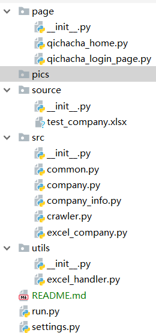
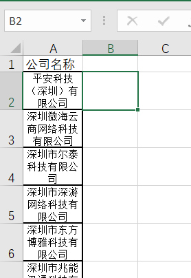
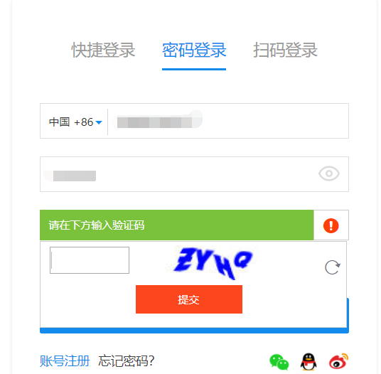

# Crawler

Crawler 是一个专门用来爬取企业信息的爬虫工具

# 目录结构



- data 存放抓取后保存数据的excel
- page 存放企查查的相关页面的PageObject
- source 存放需要抓取的企业信息excel
- src 存放爬取相关的文件
- utils 存放工具文件
- settings.py 工程的全局配置文件
- run.py 工程的路口

# 文件说明
- run.py \
``` python
if __name__ == '__main__':
    from src.excel_company import ExcelCompany

    base_url = 'https://www.qichacha.com'
    scrapy = Crawler(base_url)
    scrapy.login()
    company = CompanyInfo()
    # 获取需要爬取的公司列表
    company_list = company.get_company_names()
    # 获取公司信息表的名称
    excel_name = company.get_excel_name().split('.')[0]
    company_info_list = []
    # 初始化一个data表用来保存数据，名称与source表的名称一致
    company_excel = ExcelCompany(excel_name)
    excel_path = company_excel.generate_excel()

    for num,company_name in enumerate(company_list):
        company_info = scrapy.scrpay_company_info(company_name)
        company_info_list.append(company_info)
        if len(company_info_list) >= 10:
            company_excel.save_data(excel_path,company_info_list)
            company_info_list = []
        # 如果结束时，company_info_list的数量小于10，则把剩下的添加进去
        if num+1 == len(company_list):
            company_excel.save_data(excel_path,company_info_list)
 ```

  1. 默认每爬取10条企业信息，写入一次到excel

# 快速开始

1. 将需要爬取的企业信息放入到excel中,格式如下: \
      \
     > 第一行随便写，默认从第二行开始读取企业名称
2. 运行run.py \
      \
     > 程序会自动输入在settigs.py中配置的账号密码，但是需要手动到控制台输入验证码 \
     > __目前没有实现自动识别输入的功能，后续会更新__
3. 到控制台输入看到的验证码 \
      \
     > 验证错误次数默认最多为5，可以在settings.py中修改
4. 查看抓取企业信息 \
      \
     > 抓取后自动生成一个excel，名称与source文件夹下的修改时间最新的一致
     > 抓取后的结果如下

     


